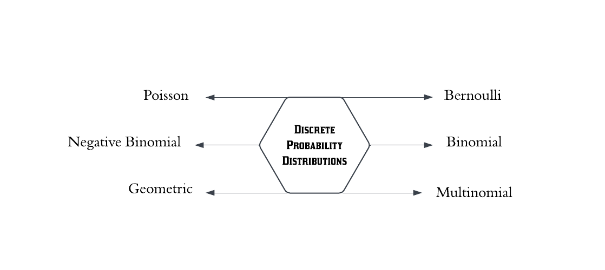
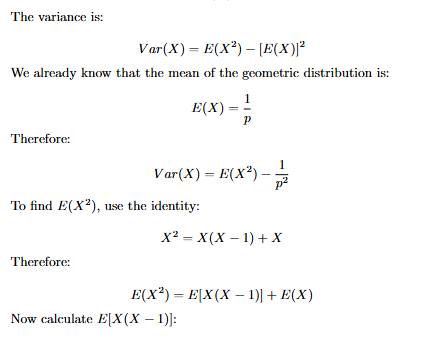
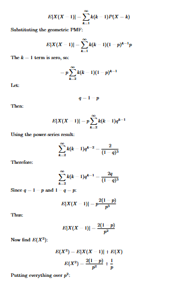
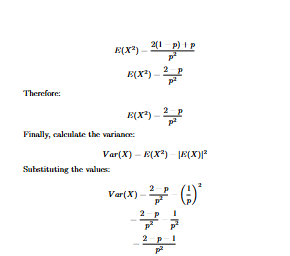
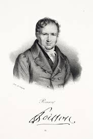
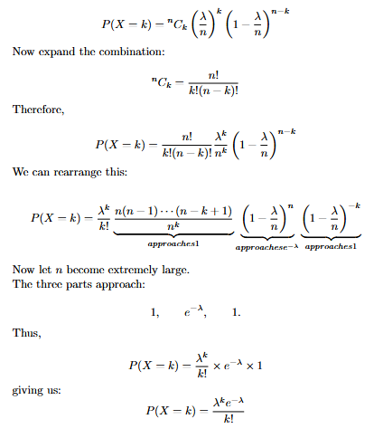
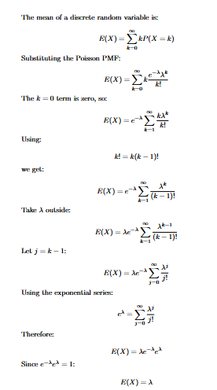
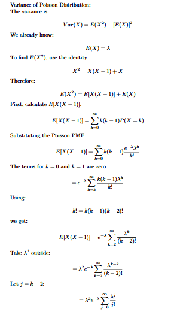
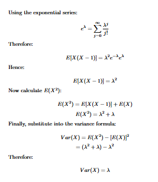
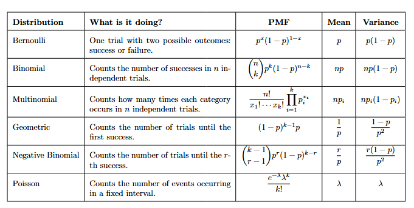

# Bernoulli Asked “Success or Failure.” Poisson Asked “How Many? #

## Understanding six common discrete probability distributions through the questions they answer ##


In my previous blog, I have talked about some basic topics which add up to this article. Without going into depth, I will touch the surface once again to keep the flow. So, if you haven't gone through the previous blog, I would highly recommend going through it once, or for now, bear with me.

Let us segregate *"Discrete Probability Distributions"* first. 

In my last blog, "PMF, PDF & CDF: Three Ways Probability Helps Us Understand Data", I introduced you to the concept of a **Random Variable**. A whole discussion was done around it. Let us revise it once again with an example we took earlier:

Tossing an unbiased coin gives us the outcomes *H* and *T*. If we take *X = H → 1* and *X = T → 0*, then *X* becomes a **Random Variable**.

And the probability for each will be 0.5 as it is an unbiased coin. So, if you want me to give you a proper definition for **Probability Distributions**, it will be:

**A probability distribution is a mathematical way of describing how probability is spread across the possible values of a random variable.**

Also we had a good discussion around *Discrete* and *Continuous* random variables in my same blog. That naturally connects here, as **Discrete Probability Distributions** are used when the random variable takes countable values. Which sums up to something like *X = {0,1,2...}*. All the values of *Random Variable* are *Discrete* in nature.

**But why do we need it?**

That's a valid question, isn't it? We are talking about this so that we can get a clear structure to work on.
How likely is the 0 value? What about 1 and so on, i.e.

*X* --> *Probability*

0   --> 0.5

1   -->  0.5

We also learned that while dealing with Discrete Random Variables, we use the **Probability Mass Function**. This gives us a **Discrete Probability Distribution**.

A valid PMF must satisfy two conditions:

1. Probability cannot be negative
2. All probabilities must add up to 1

In simple words, for a large number of experiments, it gives us a mathematical rule to calculate the probability:*"Probability Mass function(PMF)"*.

After this, it might naturally occur to us that there is one single **Discrete Probability Distribution**, but that's not the case. There are several important distributions, each designed for a particular type of random experiment.



Let's start with

**1. Bernoulli Distribution** :

The Bernoulli distribution is named after **Jacob Bernoulli** (1655–1705), a Swiss mathematician who studied probability and repeated experiments with two possible outcomes.


While tossing a coin, we are dealing with two possible outcomes: '*Head (H)*' and '*Tail (T)*'.
If *X = 1 --> H* and *X = 0 --> T* then *P(X = 1) = p* and *P(X = 0) = 1 - p*.

Then the *PMF* becomes 

*P (X = x) = p^x(1−p)^{1−x}*

,x∈{0,1}

The key idea here is to remember *what are we doing in a single trial with two possible outcomes*.

The general formula for the **expected value** of a discrete random variable is:

$$E[X] = \sum_{x} x P(X = x)$$

For a Bernoulli random variable, the value of \(X\) can be either 0 or 1.

so the Mean becomes : $$E[X] = 0 P(X = 0) + 1 P(X = 1)$$
$$E[X] =  0 (1-p) + 1 (p)$$
$$E[X] = p$$

    Mean --> Probability of Success

and Variance becomes :

$$Var(X)=E[X^2]−(E[X])^2$$

Since X can only be 0 or 1:

$$X^2 = X$$

*$$0^2 = 0$$* *$$1^2 = 1$$*

Therefore:

$$E[X^2]=E[X]=p$$

Substitute into the variance formula:

$$Var(X)=p−p^2$$
$$Var(X)=p(1-p)$$

*Variance is 0 for values of \(p=0,1\), but maximum at \(p=0.5\).*

             *max Var(X)=0.25​*


**2. Binomial Distribution** :

Now what if I toss a coin one time and want to do it again? And again? And again, for a fixed number of times. Then what ? Repeating Bernoulli trials again and again gives us the *Binomial Distribution*.

Asking something like *Toss a coin 10 times. How many heads will we get?* On tossing coin 10 times it is possible we do not get head in any flip or what if we got head in all or in some i.e

$$ X=\text{number of heads} $$

Possible values:

$$ X\in\{0,1,2,\ldots,10\} $$

This is a **Binomial distribution**.

The PMF is:

$$ P(X=k) = \binom{n}{k}p^k(1-p)^{n-k} $$

where:

\(n\) = number of trials

\(k\) = number of successes

\(p\) = probability of success

Binomial is simply the number of successes across \(n\) independent Bernoulli trials. Therefore,

Mean: $$E[X] = np$$

Variance: $$Var(X)=np(1-p)$$

Here the important thing to mention is the events performed should be independent of each other. Suppose if 

*X = X1​+X2​*

The general formula is:

$$ Var(X_1+X_2) = Var(X_1)+Var(X_2)+2Cov(X_1,X_2) $$

For independent trials:

$$ Cov(X_1,X_2)=0 $$

Therefore:

$$ Var(X_1+X_2) = Var(X_1)+Var(X_2) $$

For \(n\) independent Bernoulli trials:

$$Var(X)=np(1−p)$$

But if the trials were dependent, we couldn't simply use that formula.

This is one reason the assumptions of a distribution matter.


**3. Multinomial Distribution** :

It has the same foundation as the *Binomial Distribution*, but the key difference, as suggested by the name Multinomial, is that above we were dealing with *success (1)* or *failure (0)*, but here we have more than two categories. On rolling a die, we have 6 possible outcomes per trial and count each category. We are still working with a number of trials, but not with just two possible outcomes, hence making it a **Multinomial Distribution**.

The PMF is

$$ { P(X_1=x_1,\ldots,X_k=x_k) = \frac{n!}{x_1!x_2!\cdots x_k!} p_1^{x_1}p_2^{x_2}\cdots p_k^{x_k} } $$

where

$$x1+x2+⋯+xk=n$$

The counts across all categories must add up to the total number of trials and 


$$p1​+p2​+⋯+pk​=1$$

Therefore:

$$ \boxed{ \text{Multinomial PMF} = \text{number of arrangements} \times \text{probability of each one arrangement} } $$

That's the intuition behind the formula.


The idea for *Mean* and *Variance* is kinda same just we need to consider category \(i\),

Xi = number of times category i occurs.

Therefore *Mean*:

$$E[Xi]=npi
$$	​


*Variance*:

$$Var(Xi)=npi(1−pi)$$


**4. Geometric Distribution** :

Okay, so till now we were focusing on getting how many successes in a particular number of trials. But what if I only want to do my experiment until I get my first success? I will keep tossing my coin till i get my first head either be it first time or fifth or tenth...

To get the first success on the \(k\)-th trial, we need \(k-1\) failures first, followed by one success. Therefore,
 PMF is:

$$P(X=k)=(1−p)^{k−1}
p$$

Here, \(X\) represents the number of trials until the first success.

Mean:

For one success, if the probability of success is \(p\), the expected number of trials is:


$$E[X]=\frac{1}{p}$$


$$ \boxed{\text{smaller }p\Rightarrow\text{longer waiting time}} $$

Variance:











Hence, finally we got:
$$Var(X)=\frac{1-p}{p^2}$$

So when success becomes rare, not only do we wait longer, but the waiting time becomes much more unpredictable.

That's why the variance grows rapidly as \(p\) becomes small.


**5. Negative Binomial Distribution** :
In a similar fashion, above we went for the first success, and now I want the \(r\)-th success, so we go for the **Negative Binomial Distribution**.

*PMF* is :
$$P(X=k)= \binom {k-1}{r-1} p^r
(1−p)^{k−r}$$

provided \(X\) means number of trials until the \(r\)-th success.

where $$(k \ge r)$$

    Geometric is a special case of the Negative Binomial when r = 1.

Now let us discuss where this came from.

Let *X* be the number of trials to get r-th success. Now the question is *what is the probability of getting success exactly at k-th trial?*

For this, the \(k\)-th position should have the \(r\)-th success, and the first \(k-1\) positions must contain \(r-1\) successes, so therefore (k−1)−(r−1) = k−r failures.

Which gives us $$p^r(1−p)^{k−r}$$

But this is not yet the PMF. The trials before the final success can be arranged in different ways, which is why we need the combination term:  $$ \binom {k-1}{r-1} $$  Combining all gives us the PMF of Negative Binomial Distribution i.e
    $$P(X=k)= \binom {k-1}{r-1} p^r
(1−p)^{k−r}$$

Now let us learn about mean and variance in depth.

Mean:

For one success, if the probability of success is \(p\), the expected number of trials is:

$$E[X]=\frac{1}{p}$$

For r successes we need to add this r times, giving us :

$$E[X]=\frac{r}{p}$$

​
Variance:

same goes for the variance adding up r times resulting in :
$$Var(X)=r(\frac{1-p}{p^2})$$


**6. Poisson Distribution** :

The Poisson distribution is named after the French mathematician and physicist **Siméon Denis Poisson**, who introduced the concept in his 1837 work on probability.



Poisson is the most interesting one out of all because it is not giving us the number of successes in trials, nor telling us when we will get our first or \(r\)-th success. It is asking a totally different question.

*"It is counting how many times an event takes place in a fixed interval of time, space, area, etc."*

Its PMF is:

$$ P(X=k)=\frac{e^{-\lambda}\lambda^k}{k!} $$

where:

\(k\) = number of events

\(λ\) = average number of events in the interval

The Poisson model assumes that events occur independently and at a constant average rate over the interval.

Now the thing is how we landed up here?
Recall the Binomial PMF :

$$ P(X=k) = \binom{n}{k}p^k(1-p)^{n-k} $$

This is calculating probability of exactly k successes in n trials.

To derive Poisson, imagine dividing one minute into \(n\) very tiny intervals.

If the average number of events per minute is \(λ), then, after dividing one minute into \(n\) very small intervals, the probability of an event in each interval is approximately

$$p = \frac{λ}{n}$$

substituting this into **Binomial PMF** gives:



The most interesting thing to see mathematically here is the

**Mean = Variance = λ**

Let's see how it came part by part:







-----

## Practice Questions: ##


Question: A biased coin has a probability of 0.6 of landing on heads. If the coin is tossed once, let X=1 if the outcome is heads and X=0 if the outcome is tails.

Find:
1. The PMF of X.

2. The mean and variance of X.

Solution :

Since there are only two possible outcomes, X follows a Bernoulli distribution with parameter p=0.6.

1. PMF

The PMF of a Bernoulli random variable is:

$$P(X=x)=p^x(1−p)^{1−x}$$

x∈{0,1}

Substituting p=0.6:

$$P(X=x)=0.6^x(1−0.6)^{1−x}$$


For *X* = 0:

$$P(X=0)=0.4$$

For *X* = 1 :

$$P(X=1)=0.6$$

2. Mean

The expected value of a Bernoulli random variable is:

$$E[X] = p$$

Therefore:

$$E[X] = 0.6$$


3. Variance

The variance is:

$$Var(X)=p(1−p)$$

Substituting p = 0.6:

$$Var(X) = 0.6(0.4)$$

$$Var(X) = 0.24$$


```
from scipy.stats import bernoulli

# parameter for the distribution
p = 0.6

#  create bernoulli distribution
X = bernoulli(p)

# pmf
print("P(X=0):",X.pmf(0))
print("P(X=1):",X.pmf(1))

# mean
print("Mean:",X.mean())

# variance
print("Variance:",X.var())
```
-----

Question: A factory produces electronic components, and historical data shows that 10% of the components are defective. A quality-control engineer randomly selects 8 components independently.

Let X represent the number of defective components among the 8 selected components.

Find:

1. The PMF of X.

2. The probability that exactly 2 components are defective.

3. The mean and variance of X.


Solution:

This is a Binomial Distribution because:

There is a fixed number of trials: n=8.

Each trial has two possible outcomes: defective or non-defective.

1. PMF of the Binomial Distribution

The PMF is:

$$ P(X=k) = \binom{n}{k}p^k(1-p)^{n-k} $$

where k=0,1,…,n.

Substituting n = 8 and p = 0.1:

$$ P(X=k) = \binom{8}{k}(0.1)^k(0.9)^{8-k} $$

2. Probability of exactly 2 defective components

We need to find:

$$ P(X=2) = \binom{8}{2}(0.1)^2(0.9)^{6}$$

$$P(X=2)=28(0.01)(0.531441)$$

$$P(X=2)=0.14880348$$

So, the probability of exactly 2 defective components is approximately 14.88%.

3. Mean and variance

For a Binomial Distribution:

$$E[X]=np$$
$$E[X]=8(0.1)$$
$$E[X]=0.8$$
The variance is:

$$Var(X)=np(1−p)$$
$$Var(X)=8(0.1)(0.9)$$
$$Var(X)=0.72$$

```
from scipy.stats import binom

# parameters
n = 8
p = 0.1

# create binomial distribution 
X = binom(n,p)

# PMF
print("P(X=2):",X.pmf(2))

#mean
print("Mean:",X.mean())

# Variance
print("Variance:",X.var())

```
-----

Question : A survey asks 10 customers which of three payment methods they prefer:

Cash: probability \(p_1=0.5\)

Card: probability \(p_2=0.3\)

UPI: probability \(p_3=0.2\)

Assume each customer's choice is independent.

Let:

\(X_1\) = number of customers choosing Cash

\(X_2\) = number of customers choosing Card

\(X_3\) = number of customers choosing UPI

Find:

1. The probability that 5 customers choose Cash, 3 choose Card, and 2 choose UPI.
2. The mean and variance of the number of customers choosing each payment method.

Solution :

This is a Multinomial Distribution because:

There is a fixed number of trials: \(n=10\).

Each trial can have more than two possible categories.

1. Probability of 5 Cash, 3 Card and 2 UPI

PMF is:

$$ { P(X_1=x_1,X_2=x_2,X_3=x_3) = \frac{n!}{x_1!x_2!x_3!} p_1^{x_1}p_2^{x_2}p_3^{x_3} } $$


$$ { P(X_1=5,X_2=3,X_3=2) = \frac{10!}{5!3!2!} (0.5)^{5}(0.3)^{3}(0.2)^{2} } $$

$$\frac{10!}{5!3!2!} = 2520$$

$$ { P(X_1=5,X_2=3,X_3=2) = 2520 (0.5)^{5}(0.3)^{3}(0.2)^{2} } $$

$$ { P(X_1=5,X_2=3,X_3=2) = 0.08505} $$


2. Mean and variance

For each category \(i\), the mean is:

$$ E[X_i]=np_i $$
Cash
$$ E[X_1]=10(0.5)={5} $$
Card
$$ E[X_2]=10(0.3)={3} $$
UPI
$$ E[X_3]=10(0.2)={2} $$

The variance of each category is:

$$ \text{Var}(X_i)=np_i(1-p_i) $$

So:

Cash:

$$ \text{Var}(X_1)=10(0.5)(0.5)={2.5} $$

Card:

$$ \text{Var}(X_2)=10(0.3)(0.7)={2.1} $$

UPI:

$$ \text{Var}(X_3)=10(0.2)(0.8)={1.6} $$


```
from scipy.stats import multinomial

# Parameters
n = 10
p = [0.5, 0.3, 0.2]

# Counts for each category
# Cash = 5, Card = 3, UPI = 2
x = [5, 3, 2]

# Create the Multinomial distribution
X = multinomial(n, p)

# PMF
probability = X.pmf(x)

# Mean
mean = [n * pi for pi in p]

# Variance
variance = [n * pi * (1 - pi) for pi in p]

# Print results
print("Probability:", probability)

print("\nMean:")
print("Cash:", mean[0])
print("Card:", mean[1])
print("UPI:", mean[2])

print("\nVariance:")
print("Cash:", variance[0])
print("Card:", variance[1])
print("UPI:", variance[2])
```
---

Question : A basketball player has a probability of \(0.4\) of making a free throw.

She keeps taking free throws until she makes her first successful shot.

Let \(X\) be the number of attempts required to get the first success.

Find:

1. The probability that her first successful shot occurs on the 4th attempt.
2. The mean and variance of \(X\).

Solution :


This is a Geometric Distribution because:

1. Each trial has two outcomes: success or failure.
2. We are interested in the number of trials until the first success.

The PMF is:

$$ P(X=k)=(1-p)^{k-1}p $$

For \(k=4\):

$$ P(X=4)=(1-0.4)^3(0.4) $$ $$ =(0.6)^3(0.4) $$ $$ {P(X=4)=0.0864} $$


Mean
$$ E[X]=\frac{1}{p} $$ $$ E[X]=\frac{1}{0.4} $$ $$ {E[X]=2.5} $$


Variance
$$ \text{Var}(X)=\frac{1-p}{p^2} $$ $$ =\frac{0.6}{0.4^2} $$


$$Var(X)=3.75$$

```
from scipy.stats import geom

# Parameter
p = 0.4

# Create Geometric distribution
X = geom(p)

# Probability that first success occurs on 4th attempt
probability = X.pmf(4)

# Mean
mean = X.mean()

# Variance
variance = X.var()

# Print results
print("P(X=4):", probability)
print("Mean:", mean)
print("Variance:", variance)
```


Question : A salesperson has a probability of \(0.3\) of making a successful sale on each independent customer interaction.

She continues approaching customers until she makes her 3rd successful sale.

Let \(X\) represent the number of customers approached until the 3rd success.

Find:

1. The probability that the 3rd successful sale occurs on the 8th customer.
2. The mean and variance of \(X\).


Solution :

This is a Negative Binomial Distribution because:

1. Each trial has two outcomes: success or failure.

2. We continue until we obtain a fixed number of successes, here \(r=3\).

The PMF is:

$$ P(X=k) = \binom{k-1}{r-1} p^r(1-p)^{k-r} $$

For \(k=8\) and \(r=3\):

$$ P(X=8) = \binom{7}{2}(0.3)^3(0.7)^5 $$ $$ {P(X=8)\approx0.09529569} $$

2. Mean and Variance :

Mean :

For the version where \(X\) represents the number of trials until the \(r\)-th success:

$$ E[X]=\frac{r}{p} $$ $$ E[X]=\frac{3}{0.3} $$ $$ {E[X]=10} $$


Variance
$$ \text{Var}(X) = \frac{r(1-p)}{p^2} $$ $$ = \frac{3(0.7)}{0.3^2} $$
$$Var(X)=23.3333$$
	
```
from scipy.stats import nbinom

# Parameters
r = 3
p = 0.3

# Create Negative Binomial distribution
X = nbinom(r, p)

# Probability that the 3rd success occurs on the 8th trial
# SciPy counts the number of failures before the r-th success.
# Therefore, 8 trials means 8 - 3 = 5 failures.
probability = X.pmf(8 - r)

# Mean number of failures before the r-th success
mean_failures = X.mean()

# Variance of number of failures
variance_failures = X.var()

# Convert mean to number of trials
mean_trials = mean_failures + r

# Variance remains the same
variance_trials = variance_failures

# Print results
print("P(X=8):", probability)
print("Mean number of trials:", mean_trials)
print("Variance:", variance_trials)
```

we can see above in the code, the code seems different then what we have discussed but why is it different ? Above we discussed:

X = number of trials until the \(r\)-th success

but in SciPy's nbinom:

X = number of failures before the \(r\)-th success

If the 3rd success happens on trial 8, then among the first 7 trials, there must be:

2 successes
5 failures

And trial 8 must be the 3rd success.

So:

$$ 8-3=5 $$

There are 5 failures.

That's why the code says:

    probability = X.pmf(8 - r)

which becomes:

    probability = X.pmf(5)

By the time the experiment ends at the 3rd success, there are exactly \(r=3\) successes.

Therefore:

$$ \text{trials}=\text{failures}+3 $$

So:

     mean_trials = mean_failures + r

gives:

7 + 3 = 10


------


Question : A customer-support center receives an average of 4 calls per hour.

Assume that calls occur independently and the average rate remains constant.

Let \(X\) represent the number of calls received in one hour.

Find:

1. The probability of receiving exactly 6 calls in one hour.
2. The mean and variance of \(X\).

Solution :

This is a Poisson Distribution because we are counting the number of events occurring within a fixed interval of time, and we know the average rate of occurrence.

1. The PMF is:

$$ P(X=k)=\frac{e^{-\lambda}\lambda^k}{k!} $$

For exactly 6 calls:

$$ P(X=6) = \frac{e^{-4}4^6}{6!} $$ $$ {P(X=6)\approx0.104196} $$

2. Mean and Variance:

Mean:

For a Poisson distribution:

$$ E[X]=\lambda $$

Therefore:

$$ {E[X]=4} $$
Variance:

For Poisson:

$$ \text{Var}(X)=\lambda $$

Therefore:

$$Var(X)=4$$
	

```
from scipy.stats import poisson

# Parameter
lambda_value = 4

# Create Poisson distribution
X = poisson(lambda_value)

# Probability of exactly 6 calls
probability = X.pmf(6)

# Mean
mean = X.mean()

# Variance
variance = X.var()

# Print results
print("P(X=6):", probability)
print("Mean:", mean)
print("Variance:", variance)
```

At last I want to close the blog with a helpful short summary table for you all. 



In this section, we learned about **Discrete Probability Distributions**, and i the further blog, I will be discussing **Continuous Probability Distributions**.
